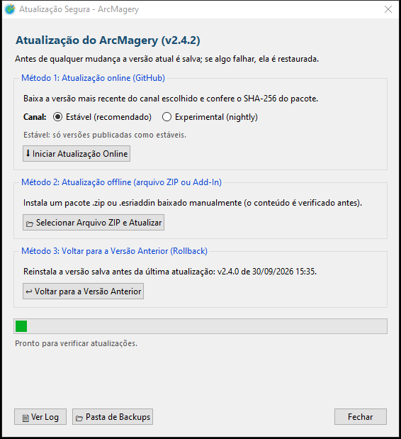

# Manual de instalação e uso | ArcMagery

<p align="center">
  
</p>

<p align="center">
  <strong>Imagens de satélite no ArcGIS Desktop (ArcMap 10.8.x), direto no TOC e na resolução nativa</strong><br>
  Google Earth Engine · CBERS/Amazônia-1 (INPE) · SPOT 1–5 (CNES) · Google Earth (atual e histórico) · Esri Wayback · XYZ<br>
  <em>Versão 2.4.7 · projeto pessoal e independente de Joberth Firmino Gambati</em>
</p>

---

## Sumário

1. [Visão geral](#1-visão-geral)
2. [Requisitos](#2-requisitos)
3. [Conta e projeto no Google Earth Engine](#3-conta-e-projeto-no-google-earth-engine)
4. [Instalação](#4-instalação)
5. [Primeiro uso no ArcMap](#5-primeiro-uso-no-arcmap)
6. [Uso](#6-uso)
   - [6.1 Google Earth Engine: satélites e períodos](#61-google-earth-engine-satélites-e-períodos)
   - [6.2 Composições e modo de carga](#62-composições-e-modo-de-carga)
   - [6.3 Índices espectrais e fórmulas](#63-índices-espectrais-e-fórmulas)
   - [6.4 Área de interesse e resolução](#64-área-de-interesse-e-resolução)
   - [6.5 Busca e tabela de resultados](#65-busca-e-tabela-de-resultados)
   - [6.6 Carga no TOC e substituição de camadas](#66-carga-no-toc-e-substituição-de-camadas)
   - [6.7 Configurações](#67-configurações)
   - [6.8 CBERS / Amazônia-1 (INPE)](#68-cbers--amazônia-1-inpe)
   - [6.9 SPOT 1–5 (CNES) e a chave do GEODES](#69-spot-15-cnes-e-a-chave-do-geodes)
   - [6.10 Google Earth histórico](#610-google-earth-histórico)
   - [6.11 Esri Wayback](#611-esri-wayback)
   - [6.12 Google Earth / XYZ](#612-google-earth--xyz)
   - [6.13 Tela de abertura](#613-tela-de-abertura)
7. [Atualizar, voltar de versão e desinstalar](#7-atualizar-voltar-de-versão-e-desinstalar)
8. [Solução de problemas](#8-solução-de-problemas)
9. [Dados guardados no computador e rede](#9-dados-guardados-no-computador-e-rede)
10. [Limitações conhecidas](#10-limitações-conhecidas)
11. [Créditos e licença](#11-créditos-e-licença)

---

## 1. Visão geral

O **ArcMagery** é um Python Add-In para o **ArcMap 10.8.x**. Ele busca, recorta e carrega imagens de
satélite direto na Tabela de Conteúdos (TOC), sem exportar para o Google Drive e sem baixar cenas inteiras
à mão. Todas as fontes, menos o XYZ, ficam na mesma janela, na barra **Fonte de imagens**.

<p align="center">
  
</p>

Principais recursos:

* **Resolução nativa por padrão:** cada fonte é recortada na resolução do próprio sensor (10 m no
  Sentinel-2, 30 m no Landsat, grade original da cena no CBERS). Há reamostragem só quando ela é
  inevitável ou pedida (veja a [seção 6.4](#64-área-de-interesse-e-resolução)).
* **ArcMap livre durante os downloads:** a interface roda em processo próprio e conversa com o ArcMap
  por arquivos JSON; o mapa continua respondendo enquanto as imagens são baixadas.
* **Multibanda:** todas as bandas num único GeoTIFF; a composição RGB é trocada depois, no próprio
  ArcMap, sem novo download.
* **Índices e fórmulas** (NDVI, NDWI, NDMI, NBR, EVI, SAVI ou expressão própria) calculados na nuvem do
  Google e baixados em ponto flutuante (Float32).

---

## 2. Requisitos

| Item | Requisito | Observação |
| :--- | :--- | :--- |
| **Sistema** | Windows 10 ou 11 (64 bits) | Outras versões do Windows não foram testadas |
| **ArcGIS Desktop** | ArcMap 10.8.x com licença (Basic, Standard ou Advanced) | Python 2.7 em `C:\Python27\ArcGIS10.8` |
| **Motor do ArcMagery** | `arcmagery_backend.exe` (~90 MB) | Python 3, GDAL, numpy e Pillow **embutidos**; baixado e conferido (SHA-256) pelo `install.bat` em `%LOCALAPPDATA%\ArcMagery\engine`. **Não é preciso QGIS** |
| **QGIS** | Só para o **QMagery** (plugin do QGIS 3.18+) | O ArcMagery não depende do QGIS |
| **Bibliotecas do Earth Engine** | `earthengine-api` e dependências | Instaladas pelo próprio ArcMagery **sem `pip`** (versões fixas, hash SHA-256 conferido) em `%LOCALAPPDATA%\ArcMagery\pylibs` |
| **Conta Google** (só para a fonte GEE) | Cadastrada no Google Earth Engine | Ligada a um Project ID do Google Cloud ([seção 3](#3-conta-e-projeto-no-google-earth-engine)) |
| **Chave do GEODES** (só para baixar SPOT) | Gratuita | A busca de cenas SPOT é livre ([seção 6.9](#69-spot-15-cnes-e-a-chave-do-geodes)) |
| **Rede** | Internet | Proxy com inspeção SSL é suportado. Lista de endereços na [seção 9](#9-dados-guardados-no-computador-e-rede) |

Não é preciso ser administrador: tudo é instalado no perfil do usuário.

---

## 3. Conta e projeto no Google Earth Engine

O Earth Engine exige uma conta Google cadastrada e um projeto do Google Cloud. O uso não comercial
(pesquisa, educação, governo, ONGs) é gratuito, sujeito à verificação de elegibilidade do Google; o uso
comercial é pago.

1. Acesse <https://code.earthengine.google.com/register> com a sua conta Google.
2. Escolha o tipo de uso (**não comercial**, quando for o caso) e siga o formulário.
3. Crie ou selecione um **projeto do Google Cloud** e anote o **Project ID** (ex.: `ee-meunome`). Ele será
   informado no ArcMagery.

O mesmo passo a passo está no ArcMagery: janela **Conectar ao GEE › Como registrar um projeto (tutorial)**.

> [!TIP]
> Os projetos podem ser consultados a qualquer momento no [console do Google Cloud](https://console.cloud.google.com/).

As outras fontes (CBERS, SPOT, Google Earth, Esri) **não** dependem do Earth Engine.

---

## 4. Instalação

### 4.1 Antes de começar

* ArcMap 10.8.x instalado e **fechado**.
* Internet funcionando (o instalador baixa o motor, ~90 MB; sem acesso ao GitHub, veja a
  [seção 8.2](#82-o-motor-não-foi-instalado-sem-internet-ou-github-bloqueado)).
* Se o Windows mostrar "O Windows protegeu o computador" ao abrir um `.bat`, clique em
  *Mais informações › Executar assim mesmo*. Para evitar o aviso, antes de extrair abra as
  *Propriedades* do ZIP e marque *Desbloquear*.

### 4.2 Instalação com o `install.bat` (recomendada)

1. Baixe o `ArcMagery-<versão>.zip` da [última Release](https://github.com/Yiuky/ArcMagery-releases/releases/latest)
   e extraia numa **pasta de caminho curto**, por exemplo `C:\ArcMagery` (caminhos longos passam do
   limite de 260 caracteres do Windows).
2. Dê um duplo clique em **`install.bat`**. O instalador:
   - confere o ArcGIS Desktop 10.8 e o Python 2.7 (e para se o ArcMap estiver aberto);
   - baixa e confere (SHA-256) o **motor** do ArcMagery, com Python 3, GDAL e numpy embutidos (~90 MB),
     usando o Python 2.7 do próprio ArcGIS (o PowerShell é só reserva);
   - roda o **diagnóstico**: cada item aparece como `[OK]`, `[CORRIGIDO]`, `[AVISO]` ou `[PROBLEMA]`, com
     *o que fazer*. Os componentes do Earth Engine são instalados sem `pip` (cerca de 25 MB e 15 s).
     Relatório: `%LOCALAPPDATA%\ArcMagery\diagnostico.txt`;
   - empacota o Add-In (`GEE_Image_Selector.esriaddin`, nome legado do arquivo), copia para a pasta de
     Add-Ins do ArcMap e o registra com o utilitário da Esri (`ESRIRegAddIn.exe`).
3. Ao final, pressione qualquer tecla para fechar.

### 4.3 Instalação manual (quando a rede bloqueia arquivos `.bat`)

1. Abra o **Prompt de Comando** na pasta extraída e gere o Add-In:
   ```cmd
   C:\Python27\ArcGIS10.8\python.exe arcgis_addin\makeaddin.py
   ```
   O arquivo `arcgis_addin\GEE_Image_Selector.esriaddin` é criado.
2. Dê um duplo clique nesse arquivo e, no *Esri ArcGIS Add-In Installation Utility*, clique em
   **Install Add-In**.
3. Os componentes do Earth Engine são instalados na primeira abertura: na tela de abertura, clique em
   **Instalar componentes do Earth Engine**.

### 4.4 Login no Earth Engine (uma vez por usuário)

1. Na janela do ArcMagery, clique em **Conectar ao GEE** e depois em **Entrar com o Google** (ou dê um
   duplo clique em **`autenticar_gee.bat`**).
2. O navegador abre a página de autorização do Google: entre com a conta cadastrada no Earth Engine e
   conceda o acesso.
3. As credenciais ficam em `%USERPROFILE%\.config\earthengine\credentials`.

> [!NOTE]
> O login costuma continuar válido entre as sessões. Se expirar ou for revogado, repita estes passos.

---

## 5. Primeiro uso no ArcMap

1. Abra o ArcMap 10.8.x.
2. Se a barra não aparecer: menu **Customize › Toolbars** e marque **ArcMagery**.
3. Clique no botão **ArcMagery** da barra. A tela de abertura confere o ambiente
   ([seção 6.13](#613-tela-de-abertura)) e abre a janela principal.
4. Para o Earth Engine: clique em **Conectar ao GEE**.
   1. **Conta Google:** clique em **Entrar com o Google** e faça o login no navegador. A janela percebe
      sozinha quando o login termina.
   2. **Projeto:** o ArcMagery busca os projetos da sua conta. Escolha um e clique em **Conectar**. Se a lista
      não vier (o Google só a fornece com a API *Cloud Resource Manager* ativa), digite o Project ID. Ainda
      não tem um projeto? Clique em **Como registrar um projeto (tutorial)**.

   O cabeçalho passa a mostrar `[OK] Conectado ao Google Earth Engine! (Projeto: ...)` e o botão vira
   **Conta e projeto GEE**, onde é possível trocar de projeto ou sair da conta.

---

## 6. Uso

### 6.1 Google Earth Engine: satélites e períodos

Ao escolher o satélite, o quadro azul da coluna esquerda mostra o período, a coleção do Earth Engine e
as bandas disponíveis.

| Satélite / sensor | Coleção do Earth Engine | Resolução | Período |
| :--- | :--- | :--- | :--- |
| Sentinel-2 (MSI, nível 2A harmonizado) | `COPERNICUS/S2_SR_HARMONIZED` | 10 m (B2, B3, B4, B8) e 20 m | 28/03/2017 em diante |
| Landsat 8 e 9 (OLI) | `LANDSAT/LC08/C02/T1_L2` + `LANDSAT/LC09/C02/T1_L2` | 30 m | 11/04/2013 em diante (Landsat 9 desde 2021) |
| Landsat 7 (ETM+) | `LANDSAT/LE07/C02/T1_L2` | 30 m | 15/04/1999 até o fim da missão (falha do SLC após 31/05/2003) |
| Landsat 5 (TM) | `LANDSAT/LT05/C02/T1_L2` | 30 m | 01/03/1984 a 05/05/2012 |
| Landsat 4 (TM) | `LANDSAT/LT04/C02/T1_L2` | 30 m | 16/07/1982 a 14/12/1993 |
| Landsat 1, 2 e 3 (MSS) | `LANDSAT/LM01` a `LM03/C02/T1` + `T2` | 60 m | 23/07/1972 a 31/03/1983 |

### 6.2 Composições e modo de carga

Composições prontas mais usadas em sensoriamento remoto:

* **Cor natural:** vermelho, verde e azul. Para interpretação visual direta.
* **Agricultura:** infravermelho de ondas curtas, infravermelho próximo e azul (ex.: 11-8-2 no Sentinel-2,
  6-5-2 no Landsat 8/9). Lavouras em verde vivo e solo exposto em magenta.
* **Falsa cor infravermelho:** vegetação em vermelho, água escura e áreas degradadas em ciano.
* **SWIR / solos:** diferencia umidade do solo e atravessa melhor fumaça e bruma.

Outras opções da lista **Composição**:

* **BANDAS PERSONALIZADAS:** digite as bandas na caixa *Bandas Personalizadas*, separadas por vírgula
  (ex.: `B4,B3,B2` no Sentinel-2 ou `SR_B5,SR_B4,SR_B3` no Landsat 8/9). As três primeiras formam o RGB
  inicial no TOC. O plugin traduz nomes equivalentes entre satélites (ex.: `SR_B5` e `B5`).
* **INDICE - FORMULA MATEMATICA:** veja a [seção 6.3](#63-índices-espectrais-e-fórmulas).

**Modo de carga no ArcMap:**

* **Multibanda bruta (recomendado):** todas as bandas num único GeoTIFF (ex.: 12 bandas no Sentinel-2).
  Para trocar a composição: botão direito na camada › *Properties › Symbology*.
* **RGB rápido:** só as 3 bandas da composição escolhida, num arquivo menor.

### 6.3 Índices espectrais e fórmulas

Os índices são calculados nos servidores do Earth Engine e chegam como uma banda Float32, com rampa de
cores no TOC:

* **NDVI** (vigor da vegetação): (NIR − Vermelho) / (NIR + Vermelho)
* **NDWI** (água): (Verde − NIR) / (Verde + NIR)
* **NDMI** (umidade da vegetação): (NIR − SWIR1) / (NIR + SWIR1)
* **NBR** (áreas queimadas): (NIR − SWIR2) / (NIR + SWIR2)
* **EVI** e **SAVI**: índices de vegetação com correção de atmosfera e de solo

**Fórmula própria:** escolha **INDICE - FORMULA MATEMATICA** na lista *Composição* e digite a expressão:

- Sentinel-2: `(B8 - B4) / (B8 + B4)` ou `(B8 - B11) / (B8 + B11)`
- Landsat 8/9: `(SR_B5 - SR_B4) / (SR_B5 + SR_B4)`

### 6.4 Área de interesse e resolução

Em **Área de interesse** há duas opções:

1. **Extensão da tela do ArcMap:** usa a área visível do Data Frame. A escala precisa ser **1:500.000 ou
   mais próxima** (o cabeçalho mostra a escala atual). Para áreas de trabalho comuns, prefira escalas
   como 1:50.000 a 1:250.000. O botão **Ajustar 1:500.000** leva o mapa ao limite aceito.
2. **Camada vetorial (AOI):** lista as camadas vetoriais do TOC. O recorte usa o **retângulo envolvente**
   (extensão) da camada inteira, ampliado pela margem de buffer (padrão 1.000 m, ajustável em
   *Configurações*). O recorte não segue o contorno do polígono nem considera feições selecionadas.

**Resolução:** o recorte é pedido na resolução nominal do sensor. Há reamostragem só nestes casos:
bandas de 20 m do Sentinel-2 num multibanda de 10 m; banda SWIR do SPOT 5 (20 m para 10 m); alinhamento
do SPOT à Esri; reprojeção opcional dos mosaicos XYZ; e quando você muda o **Tamanho do Pixel**.

**Áreas grandes:** o Earth Engine limita cada download a 48 MB. Acima disso, o ArcMagery divide a área em
quadrantes, baixa em paralelo e junta tudo num único GeoTIFF com GDAL, mantendo a resolução.

### 6.5 Busca e tabela de resultados

1. Informe a **Data Inicial** e a **Data Final** (`DD/MM/AAAA`) ou use os atalhos **30d**, **60d** e **90d**.
2. Clique em **Buscar Imagens no GEE** (o rótulo muda conforme a fonte).
3. A tabela mostra:
   - **Data / Hora** da passagem;
   - **Nuvens (%)** sobre a cena;
   - **Tile / P-R:** tile MGRS (Sentinel-2) ou órbita/ponto (Landsat). A busca mede no servidor quanto da
     área cada cena cobre com imagem válida: cenas abaixo de 0,5% (ex.: na borda da faixa imageada) não
     aparecem, e as parciais mostram a cobertura (ex.: `21LVD · 21% da AOI`);
   - **Nome da Cena** no acervo;
   - **Status:** se a cena já foi carregada.
4. Selecione uma ou várias linhas (Ctrl / Shift) e use **Miniatura** para conferir antes de baixar.

### 6.6 Carga no TOC e substituição de camadas

* **Carregar no ArcMap:** baixa as cenas selecionadas (com fila, uma de cada vez) e insere cada GeoTIFF no
  TOC. Com **Agrupar no TOC**, as camadas entram num grupo com o nome indicado.
* **Substituir no TOC:** troca os dados de uma camada raster já carregada pela nova data, mantendo a
  posição dela no mapa.
* **Simbologia conferida:** imagens multibanda entram como *RGB Composite* com as bandas escolhidas;
  imagens de uma banda (índices, pancromática) entram como *Stretched*. O stretch das Configurações é
  aplicado e conferido depois da inserção; se algo não puder ser garantido, um aviso é exibido.
* **Arquivos inválidos não entram no mapa:** antes de inserir, o plugin confere bandas, dimensões, CRS e
  pixels. Um raster todo NoData ou constante é recusado com aviso.

### 6.7 Configurações

Botão **⚙ Configurações** no topo da janela.

**Aba Visualização & TOC**

* **Stretch:** *Standard Deviations* (ex.: 2,0 desvios), *Minimum-Maximum*, *Percent Clip* (os
  percentuais seguem *Customize › ArcMap Options › Raster*; o ArcObjects 10.8 não permite defini-los por
  camada) e a origem das estatísticas, incluindo o **DRA** (ajuste à área visível).
* **Aplicar e Garantir Stretch Atual nas Camadas do ArcMap:** reaplica o stretch a todas as camadas
  raster do mapa, preservando a combinação de bandas de cada uma.
* **Visualização no TOC:** camadas entram marcadas e desenhadas, ou desmarcadas (útil para carregar
  muitas cenas sem redesenhar o mapa a cada uma).

**Aba Processamento & Sistema**

* Núcleos de processamento e threads de download de tiles.
* **Margem de buffer da AOI** em metros.
* **Atualização do Plugin:** abre o assistente de atualização ([seção 7](#7-atualizar-voltar-de-versão-e-desinstalar)).

**Aba Chave do GEODES (SPOT):** veja a [seção 6.9](#69-spot-15-cnes-e-a-chave-do-geodes).

### 6.8 CBERS / Amazônia-1 (INPE)

Escolha **CBERS / Amazônia-1** na barra *Fonte de imagens*. Não é preciso login. A janela se adapta:
*Satélite / Sensor* lista as coleções do catálogo STAC do INPE e *Composição* lista os produtos. Os campos
exclusivos do GEE (bandas personalizadas, modo de carga e tamanho do pixel) ficam desabilitados, porque o
recorte é sempre na grade nativa da cena.

| Coleção | Resolução | Produtos |
|---|---|---|
| CBERS-4A WPM | 8 m (multiespectral) e 2 m (pancromática) | cor natural, falsa cor, multibanda, pancromática |
| CBERS-4A WPM fusionada (PCA) | 2 m | RGB fusionado |
| CBERS-4/4A MUX | 16–20 m | cor natural, falsa cor, multibanda |
| CBERS-4/4A WFI e Amazônia-1 WFI | 55–64 m | cor natural, falsa cor, multibanda |
| CBERS-4 PAN 10 m / 5 m | 10 m / 5 m | falsa cor e multibanda / pancromática |
| Cubos de 8/16 dias e 2 meses (WFI, MUX) | 20–64 m | cor natural, falsa cor, multibanda, **NDVI**, **EVI** (sem nuvens) |
| Nível 2 (WPM, MUX, WFI, PAN, Amazônia-1) | 2–64 m | como no nível 4, sem ortorretificação (geometria menos precisa) |
| Histórico CBERS-2/2B CCD (2003–2010) | 20 m | cor natural, falsa cor, multibanda, pancromática |
| Histórico CBERS-2B HRC (2007–2010) | 2,5 m | pancromática |
| Histórico CBERS-2/2B WFI | 260 m | multibanda (vermelho e NIR) |
| Mosaicos Brasil (CBERS-4) e Paraíba (CBERS-4A) | 55–64 m | RGB visual |

1. Escolha a coleção, o produto, o período e a área, e clique em **Buscar Cenas no INPE**.
2. A coluna *Órbita/Ponto · Cobertura* mostra quanto da área cada cena cobre de fato; cenas que não cobrem
   a área são omitidas. Coleções em DN não informam nuvens (`n/d`).
3. Selecione as cenas, confira com **Miniatura** e use **Carregar no ArcMap**.

* Só o recorte é transferido: o plugin lê por HTTP apenas a janela de pixels da área, na grade e
  resolução nativas da cena.
* Os valores são DN ou refletância de superfície, conforme a coleção. O multibanda mantém a ordem
  espectral (azul, verde, vermelho, NIR) e é exibido em cor natural.
* Nas coleções de **Nível 2** e no **CBERS-2/2B**, o contorno publicado pelo INPE é só o retângulo da
  passagem (e às vezes nem ele confere). Por isso a busca **mede a cobertura na própria imagem** (leitura
  reduzida da janela da área) e descarta as cenas sem imagem na área; ela leva ~15 s nessas coleções, em
  vez de ~2 s. Se a medição falhar (rede), a tabela mostra a estimativa como "até X% da AOI".
* Depois do recorte, o plugin avisa se a imagem cobrir menos de 50% da área.

### 6.9 SPOT 1–5 (CNES) e a chave do GEODES

Acervo **SPOT World Heritage** do CNES (1986–2015, licença aberta Etalab 2.0), acessado pela API do portal
[GEODES](https://geodes-portal.cnes.fr). Escolha **SPOT 1-5 (CNES)** na barra *Fonte de imagens*.

| Grupo (Satélite / Sensor) | Resolução | Bandas no arquivo |
|---|---|---|
| SPOT 1, 2 e 3 multiespectral (1986–2009) | 20 m | XS3 (NIR), XS2 (vermelho), XS1 (verde) |
| SPOT 1, 2 e 3 pancromática | 10 m | PAN |
| SPOT 4 multiespectral (1998–2013) | 20 m | XS3, XS2, XS1, SWIR |
| SPOT 4 pancromática | 10 m | PAN (banda M) |
| SPOT 5 multiespectral (2002–2015) | 10 m | XS3, XS2, XS1, SWIR (20 m reamostrado para 10 m) |
| SPOT 5 pancromática | 5 m (HM) e 2,5 m (THR) | PAN |

* **Busca:** livre, sem chave e sem gastar cota. A tabela mostra data, nuvens, satélite, resolução, modo e
  quanto da área cada cena cobre. **Miniatura** mostra a prévia oficial.
* **Composições:** *falsa cor* (NIR, vermelho, verde), *SWIR, NIR, vermelho* (SPOT 4 e 5), *multibanda* e
  *pancromática*. O SPOT não tem banda azul, então não há cor natural.
* **Download:** exige a chave gratuita do GEODES (cota de 50 cenas por hora). Cada cena é um pacote de 15 a
  110 MB, baixado uma vez e guardado em `%LOCALAPPDATA%\ArcMagery\spot_cache`; recortes seguintes da
  mesma cena não usam a cota.
* **Posição corrigida automaticamente:** o produto do CNES é de nível 1A (sem ortorretificação), com erro
  de posição de 150 a 480 m nas cenas medidas. O ArcMagery mede esse deslocamento contra a Esri World
  Imagery, em várias janelas, e o corrige antes de gravar (resíduo de cerca de 2 a 5 m nas cenas
  testadas). Se a cena tiver nuvens demais ou pouca textura em comum, ela é carregada **sem** a correção,
  com aviso.
* **Saída:** GeoTIFF em UTM (SIRGAS 2000 no Brasil), recortado à área, com pirâmides. Atribuição
  obrigatória: *"SPOT images acquired by CNES's Spot World Heritage Programme"*.

#### Como obter e cadastrar a chave do GEODES (cerca de 3 minutos)

1. Acesse <https://geodes-portal.cnes.fr>, clique em **Log in › Register** e crie a conta gratuita.
   Confirme pelo link recebido por e-mail.
2. Entre no portal, clique no seu nome (canto superior direito) › **My Profile**.
3. No quadro **Authentication**, em **API Key**, clique em **Generate** (ou copie a chave existente).
4. No ArcMagery: **⚙ Configurações › Chave do GEODES (SPOT)** › cole a chave › **Testar chave** (mostra a
   cota, ex.: *47 de 50 downloads disponíveis nesta hora*) › **Salvar chave**.
5. O botão **Como obter a chave (tutorial)** repete estes passos e abre o portal.

A chave fica só neste computador, em `%APPDATA%\ArcGEE\geodes_config.json` (texto simples, no seu perfil
do Windows). Não a compartilhe; se vazar, gere outra no portal. Também é aceita a variável de ambiente
`GEODES_API_KEY`.

### 6.10 Google Earth histórico

As datas do histórico de imagens do Google Earth, como no controle de tempo do Google Earth Pro. Escolha
**Google Earth histórico** na barra *Fonte de imagens*.

1. Em *Satélite / Sensor*, escolha o **zoom** (15 a 20; o zoom 18 tem cerca de 0,6 m por pixel) ou
   *TODOS os zooms*.
2. Defina o período e a área e clique em **Listar Datas do Google Earth**.
3. Cada linha da tabela é uma data (e um zoom), com a cobertura da área e o provedor da imagem. Coberturas
   com `~` são estimadas por amostragem.
4. Selecione uma ou várias datas e use **Carregar no ArcMap**.

A imagem sai na grade geográfica nativa do Google Earth (EPSG:4326), sem reamostragem, com até 100 mil
tiles por download.

### 6.11 Esri Wayback

As versões da Esri World Imagery publicadas desde 2014, com a **data de captura** de cada uma. Escolha
**Esri Wayback** na barra *Fonte de imagens*.

1. Em *Satélite / Sensor*, escolha o zoom (15 a 19) ou *TODOS os zooms*.
2. Defina a área e clique em **Listar Versões do Esri Wayback**.
3. Cada linha é uma versão com imagem diferente na área, com a data de captura, o satélite e a resolução.
4. Selecione as versões e use **Carregar no ArcMap**. A data de captura vai no nome da camada e nos
   metadados do GeoTIFF (Web Mercator, EPSG:3857).

### 6.12 Google Earth / XYZ

Botão **Google Earth / XYZ...** à direita da barra *Fonte de imagens*. Abre uma janela própria, com a
**Área de interesse** (extensão do ArcMap ou camada AOI) e a **Pasta de saída**.

1. Escolha a **Fonte**: Google Satélite, Google Híbrido, Esri World Imagery, Esri Clarity ou Bing Aerial.
2. Ajuste o **Zoom**. A estimativa aparece na hora: quantidade de tiles, dimensões, metros por pixel e
   volume (zoom 18 ≈ 0,57 m/pixel; zoom 19 ≈ 0,29 m/pixel em Mato Grosso).
3. Opcional: compressão LZW (sem perdas) e reprojeção para SIRGAS 2000 (EPSG:4674). Por padrão o mosaico
   fica em Web Mercator (EPSG:3857), sem reamostragem.
4. Clique em **Baixar mosaico e carregar no ArcMap**. A camada entra no grupo `ArcMagery - Google Earth / XYZ`.

* **Data das imagens (Esri):** com a fonte *Esri World Imagery*, o quadro *Data das imagens* consulta a data
  de captura de cada parte da área (satélite, fornecedor, resolução, cobertura) e o histórico do Wayback;
  dá para baixar uma data específica e carregar os polígonos com as datas de captura. Google e Bing não
  têm API pública com a data das imagens.
* **Limite:** 100 mil tiles por download. Reduza a área ou o zoom se ele for atingido.
* **Falha no meio do download:** os tiles já baixados ficam na pasta `<arquivo>_tiles`, ao lado do
  GeoTIFF de saída. Ela pode ser apagada se o download não for repetido.

> [!WARNING]
> **Termos de uso:** cada fonte de tiles tem termos próprios. O download em massa de tiles do Google
> (inclusive o histórico), do Bing e da Esri fora das APIs oficiais pode violar esses termos; para Google e
> Bing, um aviso é exibido antes do primeiro download. Para dados abertos, prefira CBERS/INPE, SPOT/CNES
> (Etalab 2.0) e o Earth Engine (conforme a licença de cada coleção).

### 6.13 Tela de abertura

Ao clicar no botão do ArcMagery, uma tela de abertura confere, em paralelo:

| Verificação | Se falhar |
|---|---|
| Python 3 do ArcMagery | ✖ Rode o `install.bat` |
| GDAL e numpy | ✖ CBERS e SPOT não funcionam: rode o `install.bat` |
| Internet: GEODES, INPE e Esri | ! Lista os serviços inacessíveis (proxy ou firewall) |
| Login do Google Earth Engine | ! As demais fontes funcionam; use **Autenticar GEE** |
| Componentes do Earth Engine | ✖ Botão **Instalar componentes do Earth Engine** (sem pip) |
| Chave do GEODES | i Opcional (só para baixar SPOT); ✖ se a chave for recusada |
| Comunicação com o ArcMap | ! A janela abre; a carga no TOC espera o ArcMap |

Com tudo certo, a janela principal abre sozinha em menos de 1 s. Com avisos, abre após 6 s (o botão
**Aguardar** pausa a contagem). O botão **Diagnosticar e corrigir** roda o mesmo diagnóstico do instalador.

---

## 7. Atualizar, voltar de versão e desinstalar

<p align="center">
  
</p>

### 7.1 Aviso de nova versão

Ao abrir, o ArcMagery confere se há versão nova no canal escolhido. Se houver, pergunta **Atualizar agora?**.
Com **Sim**, a atualização começa na hora, com o progresso numa janela pequena: a versão atual é salva, o
pacote é baixado e conferido pelo SHA-256, a interface fecha para trocar os arquivos e uma mensagem do Windows
confirma o fim. Com **Não**, o botão vermelho **Atualizar para a vX** fica na barra superior e faz o mesmo.

Se a atualização automática falhar, a janela de erro mostra o motivo e os links para baixar a versão a mão
(página de downloads e o pacote `ArcMagery-<versão>.zip`, com **Copiar link**) e o botão **Instalar de um
arquivo ZIP...**.

Se o repositório de downloads mudar de endereço, o antigo passa a indicar o novo e o ArcMagery passa a usá-lo
sozinho (para as atualizações e para o motor).

### 7.2 Assistente de atualização

**⚙ Configurações › Abrir Assistente de Atualização**:

* **Método 1, atualização online:** baixa a última Release do canal escolhido e só instala se o hash
  SHA-256 conferir com o `SHA256SUMS.txt` da Release. Instalar uma versão mais antiga pede confirmação.
  * **Canal estável (recomendado):** só versões publicadas como estáveis.
  * **Canal experimental (nightly):** recebe antes as novidades e correções, que podem ter falhas. A versão
    aparece com o selo laranja **EXPERIMENTAL** no topo da janela. Para voltar, escolha *Estável* e
    clique em *Iniciar Atualização Online*.
  * Ao abrir o assistente (e ao trocar de canal), ele mostra a versão disponível no canal comparada à
    instalada, ou "Você já está na versão mais recente".
  * Se a API do GitHub recusar a consulta (limite de 60 por hora por endereço, que se esgota numa rede em
    que todos os computadores saem pelo mesmo IP), o atualizador usa o feed de Releases e o
    `SHA256SUMS.txt`; o pacote continua conferido pelo SHA-256. Se tudo falhar, a mensagem diz o motivo
    (limite do GitHub, certificado do proxy, conexão recusada) e onde baixar o ZIP para o Método 2.
* **Método 2, arquivo ZIP:** instala um pacote `.zip` ou `.esriaddin` baixado manualmente. O conteúdo é
  verificado antes (integridade e caminhos maliciosos).
* **Método 3, voltar para a versão anterior:** reinstala o backup salvo antes da última atualização (o
  diálogo mostra a versão e a data). A versão atual é salva antes, então o mesmo botão desfaz o retorno.

Antes de qualquer mudança, a instalação atual é salva em `%LOCALAPPDATA%\CGMA_ArcGEE\backups` (nome legado
da pasta, mantido para não perder os backups existentes; ficam os 5 mais recentes). Se a cópia ou o teste
depois da instalação falharem, o atualizador tenta restaurar esse backup automaticamente. A interface fecha
para trocar os arquivos e uma mensagem do Windows confirma o fim; depois reabra o ArcMap. O registro fica em
`%LOCALAPPDATA%\CGMA_ArcGEE\logs\arcgee_updater.log`.

> [!IMPORTANT]
> Feche o ArcMap antes de atualizar.

### 7.3 Atualizar por script

* **Pasta baixada como ZIP:** baixe o ZIP da nova Release, extraia numa pasta nova e execute o `install.bat`.
* **Clone git:** feche o ArcMap e execute `atualizar.bat`. Ele traz o branch `main` (versão de
  desenvolvimento, que pode estar à frente da última versão estável) e reinstala.

### 7.4 Desinstalar

Feche o ArcMap e execute **`desinstalar.bat`**. Ele encerra a interface, remove o Add-In e limpa o cache do
ArcMap e os arquivos temporários. No fim, pergunta se você quer remover também os dados do plugin
(componentes, cache SPOT, backups, configurações e a chave do GEODES). O login do Earth Engine
(`%USERPROFILE%\.config\earthengine`) é mantido, porque outras ferramentas podem usá-lo.

---

## 8. Solução de problemas

### 8.1 O instalador mostra `[PROBLEMA]` ou `[AVISO]`

* Leia o *o que fazer* logo abaixo de cada item. O diagnóstico já corrige sozinho o que é seguro: instala
  os componentes do Earth Engine e tira de uso um venv antigo quebrado (renomeado para
  `venv.quebrado_<data>`).
* O relatório completo fica em `%LOCALAPPDATA%\ArcMagery\diagnostico.txt`. Anexe-o ao relatar um problema.

### 8.2 O motor não foi instalado (sem internet ou GitHub bloqueado)

* O `install.bat` mostra o motivo (rede, proxy, permissão da pasta, antivírus). Corrija e rode-o de novo.
* **Sem acesso ao GitHub neste computador:** em outro computador, baixe da mesma Release o
  `ArcMagery-Engine-<versão>-win64.zip` e o `.sha256` e instale offline, na pasta extraída do ArcMagery:
  ```cmd
  C:\Python27\ArcGIS10.8\python.exe arcgis_addin\Install\engine_fetch.py --from-zip "caminho\do\ArcMagery-Engine-<versão>-win64.zip"
  ```
* **Antivírus apagou o `arcmagery_backend.exe`:** libere a pasta `%LOCALAPPDATA%\ArcMagery\engine`; o ArcMagery
  reinstala o motor sozinho na próxima abertura.
* **Perfil do Windows com caminho muito longo:** defina outra pasta para o motor e rode o `install.bat` de novo:
  `setx ARCMAGERY_ENGINE_ROOT "C:\ArcMageryMotor"`.

### 8.3 "Componentes do Google Earth Engine ausentes" / `No module named 'ee'`

* Na tela de abertura, clique em **Instalar componentes do Earth Engine** (cerca de 15 s, sem pip; os
  arquivos são baixados com os certificados do Windows e conferidos por SHA-256), ou rode o `install.bat`.
* Os componentes ficam em `%LOCALAPPDATA%\ArcMagery\pylibs\py3XY`. Para reinstalar, apague essa pasta e
  repita. Em QGIS com Python 3.9 é usado o earthengine-api 1.6.15, a última versão compatível.

### 8.4 O botão do ArcMap foi clicado, mas a janela não abre

* Aguarde alguns segundos e clique de novo: se a janela anterior ainda estiver fechando, a nova só abre
  depois.
* Rode `desinstalar.bat` e depois `install.bat` para limpar arquivos antigos em cache.
* Se continuar, envie o log da sessão ([seção 8.10](#810-onde-ficam-os-logs)).

### 8.5 "A escala atual do ArcMap é maior que 1:500.000"

* Áreas muito grandes passam dos limites de memória e da API. Aproxime o mapa da área de trabalho ou use o
  botão **Ajustar 1:500.000**.

### 8.6 Erro com camada vetorial (AOI)

* O plugin reprojeta a extensão da camada para graus (WGS84/SIRGAS 2000). A mensagem diz o motivo: camada
  removida do mapa, vazia ou **sem sistema de coordenadas** (defina-o no ArcMap com *Define Projection*).

### 8.6.1 "Extensão ArcMap Indefinida"

* A mensagem mostra o **motivo**. Os mais comuns: uma janela do ArcMap aberta (ex.: *Propriedades do Data
  Frame*: feche-a), mapa sem camadas com dados ou sem sistema de coordenadas definido
  (*View › Data Frame Properties › Coordinate System*).
* Ao **carregar** uma cena, se a extensão não puder ser lida, o ArcMagery oferece usar a área da última
  busca (onde as cenas foram encontradas). Sem extensão, a **busca** não é feita (nunca numa área inventada).
* Alternativa que sempre funciona: **Camada Vetorial (AOI)**.

### 8.7 CBERS: "Erro SSL" ou "HTTP response code 0" em rede corporativa

* O ArcMagery exporta os certificados do Windows (inclusive a CA do proxy) para
  `%TEMP%\arcmagery_ca_bundle.pem` e os entrega ao GDAL. Se ainda falhar, defina a variável `CURL_CA_BUNDLE`
  apontando para o arquivo `.pem` fornecido pela equipe de TI.

### 8.8 CBERS: "A área de interesse cai fora da parte imageada da cena"

* A cena cobre o retângulo, mas não a parte com imagem (bordas sem dados de cenas inclinadas). Escolha
  outra cena com cobertura próxima de 100%.

### 8.9 SPOT

* **"O download de cenas SPOT exige a chave de API do GEODES":** cadastre a chave
  ([seção 6.9](#69-spot-15-cnes-e-a-chave-do-geodes)).
* **"GEODES recusou a chave (HTTP 401)":** a chave foi colada incompleta ou foi regenerada no portal. Copie
  de novo o texto inteiro do campo **API Key**.
* **Cota zerada:** o limite é de 50 cenas por hora; aguarde. Cenas já baixadas estão em cache e não contam.
* **"SPOT sem alinhamento":** a cena entrou, mas não pôde ser alinhada à Esri (nuvens, água ou pouca textura
  em comum). A posição pode ter erro de até cerca de 500 m. Prefira uma cena com menos nuvens ou uma área
  maior.

### 8.9.1 Erro de certificado ("CERTIFICATE_VERIFY_FAILED", "self-signed certificate in certificate chain")

* A rede, o antivírus ou um proxy corporativo está **trocando o certificado HTTPS** (inspeção SSL). O
  ArcMagery já usa os certificados do Windows e as raízes públicas, mas não confia num certificado
  desconhecido: a mensagem diz quem o emitiu, para você repassar ao TI.
* **Solução definitiva:** o TI instala o certificado raiz da inspeção no Windows (*Autoridades de
  Certificação Raiz Confiáveis*).
* **Solução local:** exporte esse certificado raiz em `.pem` (Base-64) e indique-o ao ArcMagery; depois
  reabra o ArcMap:
  ```cmd
  setx ARCMAGERY_CA_BUNDLE "C:\certificados\proxy.pem"
  ```
* A verificação do certificado **nunca** é desligada: a chave do GEODES e o login do Google não são
  enviados a um servidor não confirmado.

### 8.10 Onde ficam os logs

* **Sessão do ArcMap:** `%LOCALAPPDATA%\Temp\arcXXXX\arcgee_debug.log` (use a pasta `arc....` mais recente).
  Cada imagem carregada registra `Simbologia conferida (...)` ou o motivo de um aviso.
* **Diagnóstico:** `%LOCALAPPDATA%\ArcMagery\diagnostico.txt`.
* **Atualizador:** `%LOCALAPPDATA%\CGMA_ArcGEE\logs\arcgee_updater.log`.

Revise os arquivos antes de anexá-los a uma issue pública: eles contêm caminhos e nomes de usuário.

---

## 9. Dados guardados no computador e rede

| Local | Conteúdo |
|---|---|
| `%APPDATA%\ArcGEE` | Configurações, Project ID do GEE e chave do GEODES (texto simples) |
| `%USERPROFILE%\.config\earthengine` | Login do Google Earth Engine (gravado pela biblioteca do Google) |
| `%LOCALAPPDATA%\ArcMagery` | Motor (`engine`), componentes do Earth Engine (`pylibs`), cache SPOT e `diagnostico.txt` |
| `%LOCALAPPDATA%\CGMA_ArcGEE` | Backups e logs do atualizador (nome legado da pasta) |
| `%LOCALAPPDATA%\ESRI\Desktop10.8\AssemblyCache` | Cópia do Add-In usada pelo ArcMap |
| `%TEMP%` | Arquivos temporários da sessão e o pacote de certificados para o GDAL |

Endereços acessados (HTTPS): `earthengine.googleapis.com` e `oauth2.googleapis.com` (Earth Engine),
`files.pythonhosted.org` (componentes do Earth Engine, só na instalação), `api.github.com`, `github.com` e
`release-assets.githubusercontent.com` (atualizações: consulta, feed e download dos pacotes da Release),
`raw.githubusercontent.com` (repositório de plugins do QMagery), `data.inpe.br` (CBERS),
`geodes-portal.cnes.fr` (SPOT), `server.arcgisonline.com`, `services.arcgisonline.com`,
`wayback.maptiles.arcgis.com` e `clarity.maptiles.arcgis.com` (Esri), `khmdb.google.com` (Google Earth
histórico) e os servidores de tiles do Google e do Bing quando essas fontes são usadas.

---

## 10. Limitações conhecidas

* Funciona só no **ArcMap 10.8.x** (Windows, 64 bits). Não há versão para ArcGIS Pro.
* A AOI por camada usa o **retângulo envolvente** da camada, não o contorno do polígono.
* O ArcMap precisa estar fechado para instalar ou atualizar.

---

## 11. Créditos e licença

* **Desenvolvedor:** Joberth Firmino Gambati ([@Yiuky](https://github.com/Yiuky)).
* Projeto **pessoal e independente**: não é um produto oficial de nenhuma instituição nem fala em nome dela.
* **Downloads e atualizações:** <https://github.com/Yiuky/ArcMagery-releases>
* **Licença:** [proprietária, de uso gratuito](../LICENSE): uso livre para fins pessoais, acadêmicos, institucionais e
  periciais, com **citação obrigatória**. Redistribuição e engenharia reversa do motor dependem de autorização do
  autor; o código-fonte é fornecido sob solicitação direta. As versões até a 2.4.3 foram publicadas sob a MIT.
* **Imagens:** © Google, © Esri e parceiros, © Microsoft, CBERS/Amazônia-1 © INPE, SPOT © CNES (Etalab 2.0)
  e os provedores do Google Earth Engine. Respeite a licença de cada fonte.
